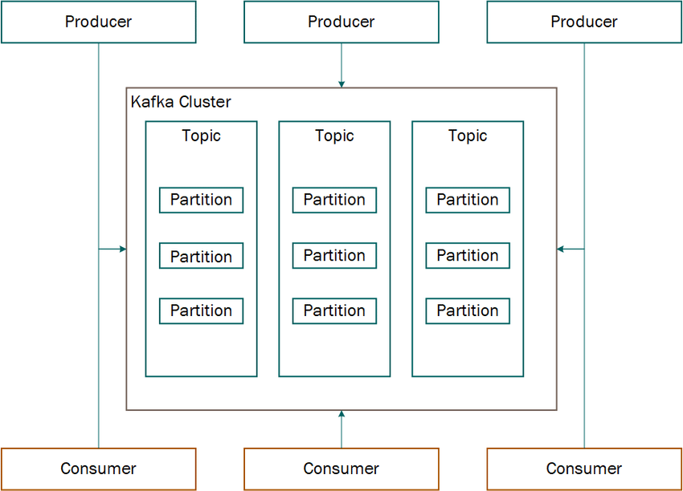

# Fraud_detection

# Apache Kafka Overview

Apache Kafka is a distributed event streaming platform designed for high-throughput, real-time data processing. It enables applications to publish, store, and process streams of records in a fault-tolerant manner.

## Key Components

1. **Producer**  
   A **producer** is responsible for publishing (writing) messages to Kafka topics. It can send data asynchronously, ensuring efficient and fault-tolerant communication.

2. **Broker**  
   A **broker** is a Kafka server that stores and manages incoming messages. Kafka clusters typically have multiple brokers to ensure scalability and fault tolerance.

3. **Consumer**  
   A **consumer** subscribes to topics and processes messages. Consumers are part of consumer groups, which allow load balancing and parallel data processing across multiple instances.

## What is an Event Streaming Platform?

An **event streaming platform** is a system that continuously captures, processes, stores, and delivers streams of data (events) in real time. Events are individual records representing something that happened, like a user clicking a button, a sensor sending a reading, or a transaction being made.

## Key Characteristics of Kafka as an Event Streaming Platform:

* **Real-time Processing**: Events are produced and consumed as they occur.
* **Durability & Scalability**: Events are stored and can be replayed, ensuring fault tolerance.
* **Decoupled Architecture**: Producers and consumers are independent, allowing flexibility in how data flows between services.
* **High Throughput**: Handles massive amounts of data efficiently.

Kafka enables businesses to build real-time data pipelines and event-driven applications by processing streams of data as they are generated. [1]

 [2]

# References
[1] “Apache Kafka,” Apache Kafka. https://kafka.apache.org/documentation/#gettingStarted

[2] Sousa, Regina & Miranda, Rui & Moreira, Ailton & Alves, Carlos & Lori, Nicolas & Machado, José. (2021). Software Tools for Conducting Real-Time Information Processing and Visualization in Industry: An Up-to-Date Review. Applied Sciences. 11. 4800. 10.3390/app11114800. 
‌
# Acknowledgement
A special thanks to TechTrapture for their wonderful video tutorial:
Darshil Parmar, “📈 Stock Market Real-Time Data Analysis Using Kafka | End-To-End Data Engineering Project,” YouTube, Dec. 04, 2022. https://www.youtube.com/watch?v=KerNf0NANMo (accessed Apr. 02, 2025).
‌